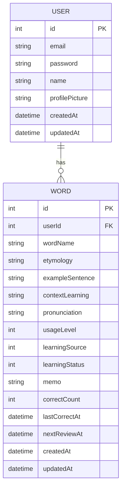

```mermaid
erDiagram
    USER {
        int id PK
        string email
        string password
        string name
        string profilePicture
        datetime createdAt
        datetime updatedAt
    }
    WORD {
        int id PK
        int userId FK
        string wordName
        string etymology
        string exampleSentence
        string contextLearning
        string pronunciation
        int usageLevel
        int learningSource
        int learningStatus
        string memo
        int correctCount
        datetime lastCorrectAt
        datetime nextReviewAt
        datetime createdAt
        datetime updatedAt
    }

    USER ||--o{ WORD : "has"
```
